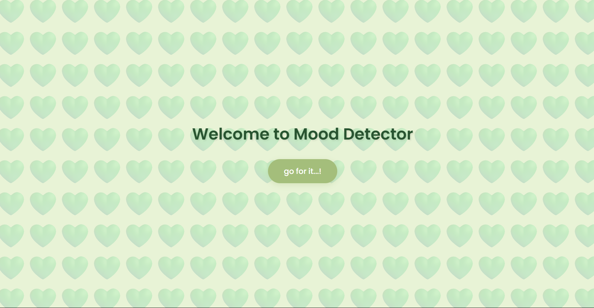

# [Project Name] 🎯

## Basic Details
### Team Name: [Name]

### Team Members
- Team Lead: [Name] - [DIYANA JAFER]
- Member 2: [Name] - [FATHIMA FARHA KK]
- Member 3: [Name] - [College]

### Project Description
["Our project is based on the mood detecter  which detects a person's mood based on the questions provided"]

### The Problem (that doesn't exist)
["We ended the devastating confusion between being sad and just needing cofee"]

### The Solution (that nobody asked for)
["It tells peoples their mood which already they know"]

## Technical Details
### Technologies/Components Used
For Software:
- HTML,CSS,JAVA SCRIPT

### Implementation
For Software:

### Project Documentation
For Software:

# Screenshots (Add at least 3)

*Add caption explaining what this shows*

*Add caption explaining what this shows*

*Add caption explaining what this shows*

# Diagrams

*Add caption explaining your workflow*

For Hardware:

# Schematic & Circuit

*Add caption explaining connections*

*Add caption explaining the schematic*

# Build Photos

*List out all components shown*

*Explain the build steps*

*Explain the final build*

### Project Demo
# Video
[Add your demo video link here]
*Explain what the video demonstrates*

# Additional Demos
[Add any extra demo materials/links]

## Team Contributions
- [Name 1]: [Specific contributions]
- [Name 2]: [Specific contributions]
- [Name 3]: [Specific contributions]

---
Made with ❤️ at TinkerHub Useless Projects 

