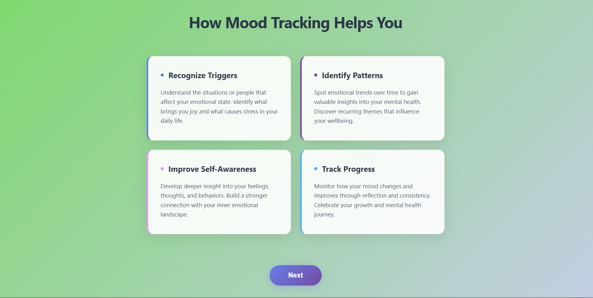
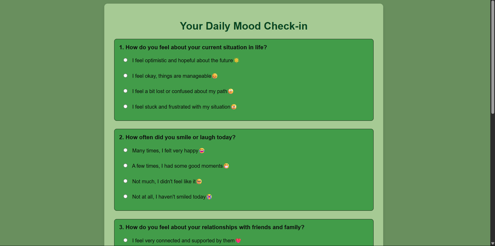

# [Project Name] 🎯

## Basic Details
### Team Name: [Name]

### Team Members
- Team Lead: [Name] - [DIYANA JAFER]
- Member 2: [Name] - [FATHIMA FARHA KK]
- Member 3: [Name] - [College]

### Project Description
["Our project is based on the mood detecter  which detects a person's mood based on the questions provided"]

### The Problem (that doesn't exist)
["We ended the devastating confusion between being sad and just needing cofee"]

### The Solution (that nobody asked for)
["It tells peoples their mood which already they know"]

## Technical Details
### Technologies/Components Used
For Software:
- HTML,CSS,JAVA SCRIPT

### Implementation
For Software:

### Project Documentation
For Software:

# Screenshots (Add at least 3)

*welcome page*

*about the importance of mood*

* the question whivh detect mood *

### Project Demo
# Videoz
[Add your demo video link here]
*Explain what the video demonstrates*

# Additional Demos
[Add any extra demo materials/links]

## Team Contributions
- [DiyanaJAFER]: [WELCOME PAGE AND questions]
- [fathima farha kk]:[result page and questions]

---
Made with ❤️ at TinkerHub Useless Projects 

